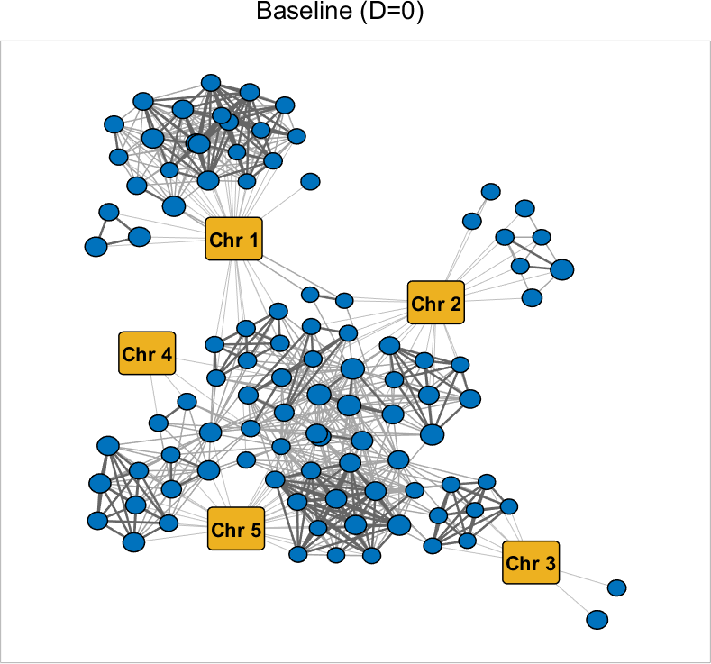

# Macarons
#### Macarons: a fast and simple algorithm to select complementary SNPs
Macarons is an algorithm designed to recover single nucleotide polymorphisms (SNPs) that are related with a phenotype in genome wide association studies (GWAS) by taking into account of the dependencies between them.

*A developmental version of Macarons on Python is now available.* For more information, please check out [the related readme file](src/python/README_python.md).

## Getting Started:
We provide a few examples on how to run Macarons on MATLAB. 
Simply run the demo file:
```
demo.m
```

In the provided examples, the genotype and flowering time phenotypes data of Arabidopsis Thaliana (AT) obtained from [Atwell et. al. (2010)](https://www.ncbi.nlm.nih.gov/pubmed/20336072) are used. For descriptions and format of the data, check the [readme file for data](data/readme_data.txt).

### Visualization of the selected variants
We also provide a demo that visualizes the correlation structure between the selected variants:
```
demo_visualization.m
```
Some examples:

 

## License
This project is licensed under GNU GPL v3 - see the [LICENSE](LICENSE) file for details.

## References
Yilmaz, S., Fakhouri, M., Koyuturk, M., Cicek, A. E. and Tastan, O. (2020). [Uncovering complementary sets of variants for predicting quantitative phenotypes](https://doi.org/10.1101/2020.12.11.419952). bioRxiv

Atwell, S. et al. (2010) [Genome-wide association study of 107 phenotypes
in Arabidopsis thaliana inbred lines](https://www.ncbi.nlm.nih.gov/pubmed/20336072). Nature, 465(7298), 627–631.
